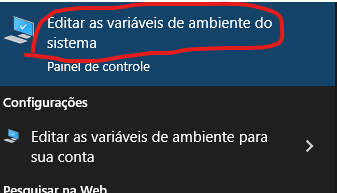
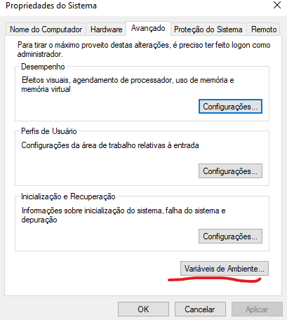
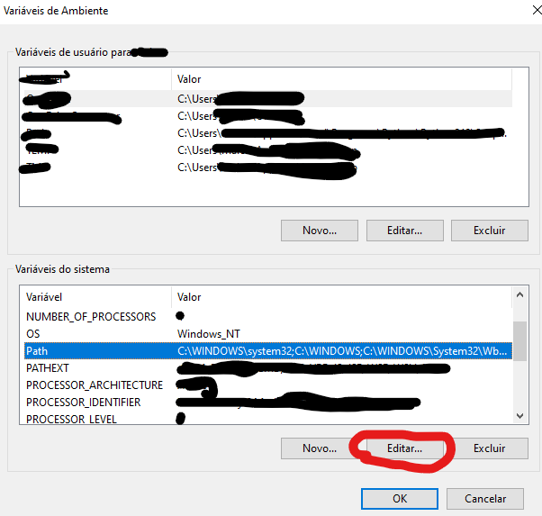
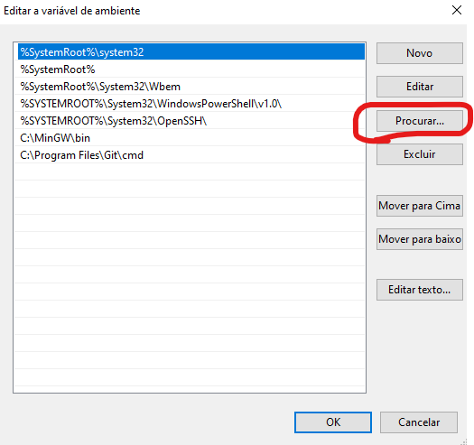
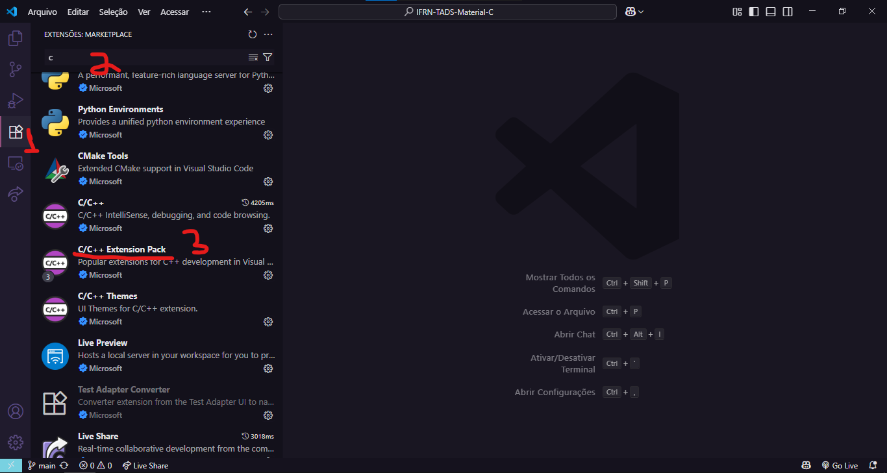
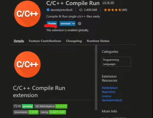
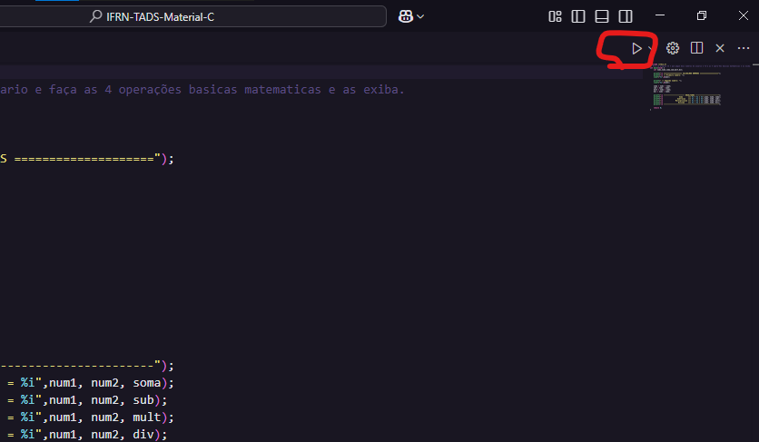

# IFRN-TADS-Material-C


Este repositório é de uso pessoal e acadêmico para a disciplina de **Programação de Computadores**, que visa desenvolver habilidades fundamentais em lógica de programação e resolução de problemas computacionais, utilizando a linguagem C como base para introdução à disciplina.


## 🎯 Este repositório foi criado com o objetivo de:

- Reunir materiais de aula em um só lugar;
- Facilitar o estudo e a revisão de conteúdos;
- Documentar atividades avaliativas e desafios propostos;
- Servir como base para futuras consultas e aprendizado contínuo da linguagem C.


## 📁 Estrutura do Repositório
  `desafios/`: contém desafios propostos em aula com foco na aplicação prática dos conceitos abordados em sala.
  
  `listas-exercicio/`: listas de exercícios regulares, criadas pelo professor e com apoio do ChatGPT, para reforçar os conteúdos vistos em aula.
  
  `avaliacoes/`: materiais avaliativos:

   - `prova/`: provas avaliativas realizadas presencialmente em sala de aula.
   - `PROG-atividade/`: tarefas enviadas como avaliação para casa.

## 💡 Tecnologias Utilizadas

- **Linguagem:** C
- **IDE:** Visual Studio Code
- **Sistema Operacional:** Windows

## 📚 Como Usar

### 1. Instalar o Visual Studio Code ou outra IDE de preferência
- Acesse o site oficial: [https://code.visualstudio.com/](https://code.visualstudio.com/)
- Clique em **Download** e baixe a versão para o seu sistema operacional (Windows, Linux ou macOS).
- Instale normalmente seguindo o assistente.

### 2. Instalar o compilador C

- Nos sistemas operacionais do Linux e macOS já vem instalado o compidador da linguagem, mas de qualquer forma execute os passos a seguir.

#### Windows (MinGW)

##### Baixar e instalar

1. Baixe o compilador C: [**Download MinGW** - sourceforge.net/](https://sourceforge.net/projects/mingw/files/MinGW/Base/gcc/Version6/gcc-6.3.0/)
- obs: video de consulta sobre os proximos passos [**Como Programar em C usando o Visual Studio Code?** - YouTube](https://youtu.be/Mook-z2uvpM?si=XTP_BJy_ilbZ65Dv)
2. Durante a instalação, selecione:
   - `mingw32-gcc-g++`
   - `mingw32-base`
3. Clique em:  
   `Installation > Apply Changes > Apply`

##### Configurar variáveis de ambiente

###### Abrir variáveis de ambiente

- Pesquise no Windows: **Variáveis de Ambiente**


- Clique em **Variáveis de ambiente...**


###### Editar Path

1. Em Variáveis de Ambiente, selecione a variável **Path** e clique em **Editar**


2. Clique em **Procurar** e selecione a pasta `bin` do MinGW  
   Normalmente: `C:\MinGW\bin`

  
###### Finalizar

- Clique em **OK** em todas as janelas para salvar

✅ Pronto, MinGW está configurado.
---

### 3. Configurando o Visual Studio Code

  Entre no Visual Studio Code
  1. Acesse a aba de extensões;
  2. Vá na barra de pesquisa e pesquise por **C**;
  3. Procure pelas seguintes exetenções para instalar
  
 

✅ Pronto, Visual Studio Code está configurado.
---

### 3. Clonar este repositório

- Abra o terminal e digite:

  ```
  git clone https://github.com/maiconroch06/IFRN-TADS-Material-C.git
  cd IFRN-TADS-Material-C
  ```

### 4. Compilar e executar algum codigo

Clique no botão para executar o codigo, ele só aparece após instalar uma extensão dita anteriormente.


## 🤝 Contribuição

Contribuições são bem-vindas! Se quiser sugerir melhorias, correções ou adicionar novos conteúdos, sinta-se livre para abrir um Pull Request.

## 👨‍💻 Autor

Este repositório foi criado por [Maicon_Rocha](https://github.com/maiconroch06) como parte do curso de **Análise e Desenvolvimento de Sistemas** **(TADS)** no **IFRN - Campus Nova Cruz**.

